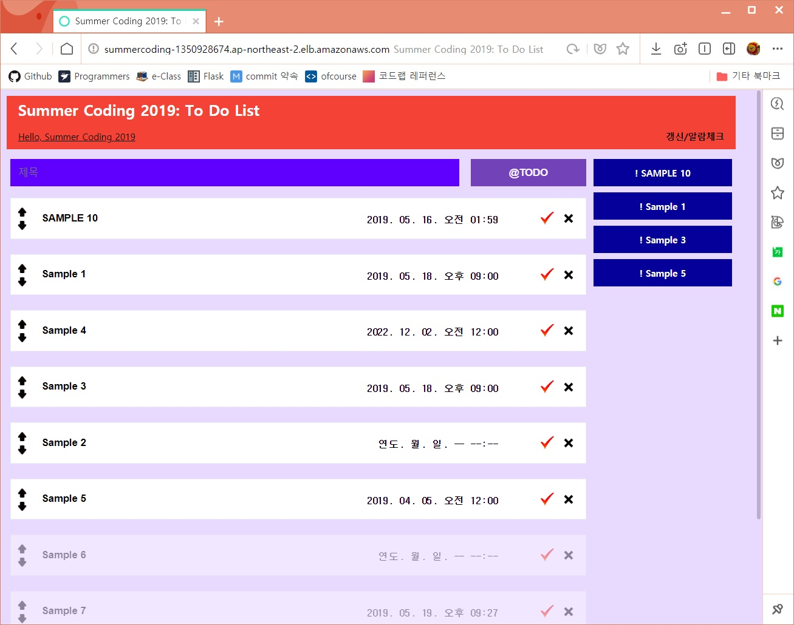

# TODO-List
프로그래머스 2019 섬머코딩 개발과제 - TODO list 만들기 (웹/서버)

URL: http://summercoding-1350928674.ap-northeast-2.elb.amazonaws.com/

## 설치 및 빌드 방법

1. 설치

        git clone https://github.com/KueNiYam/TODO-List
        
2. 필요한 모듈 설치

        pip install -r requirements.txt
        
3. 환경변수 설정

        $MYSQL_PW=<mysql password>
        
4. 서버 실행

        nohup python setup.py runserver --host=0.0.0.0 &
    
## Example

